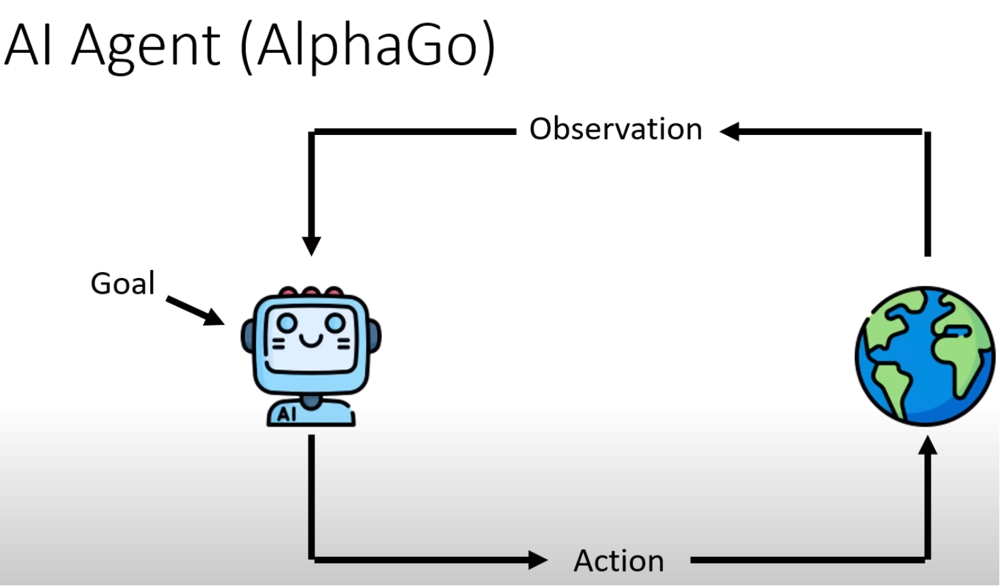
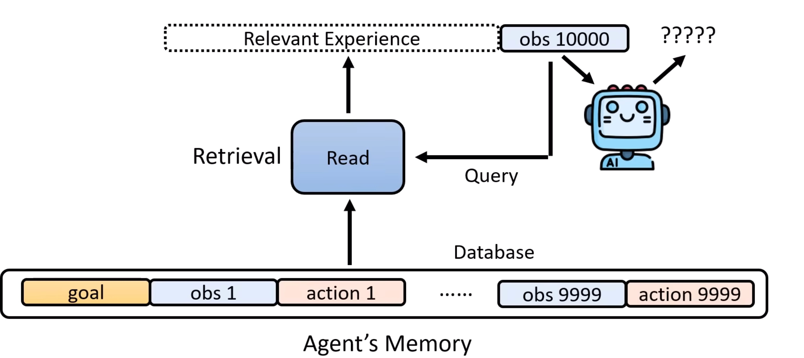
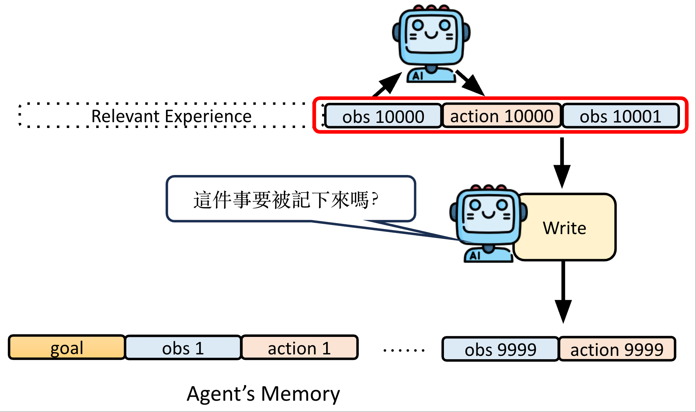
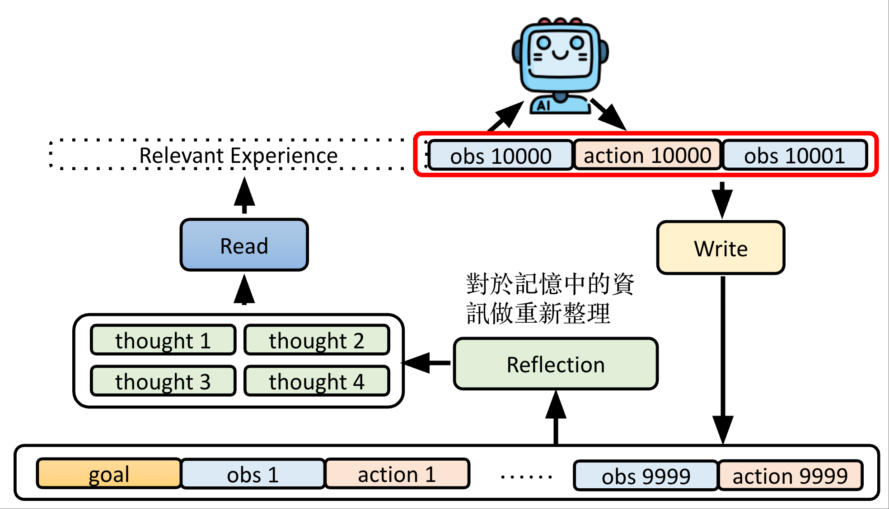
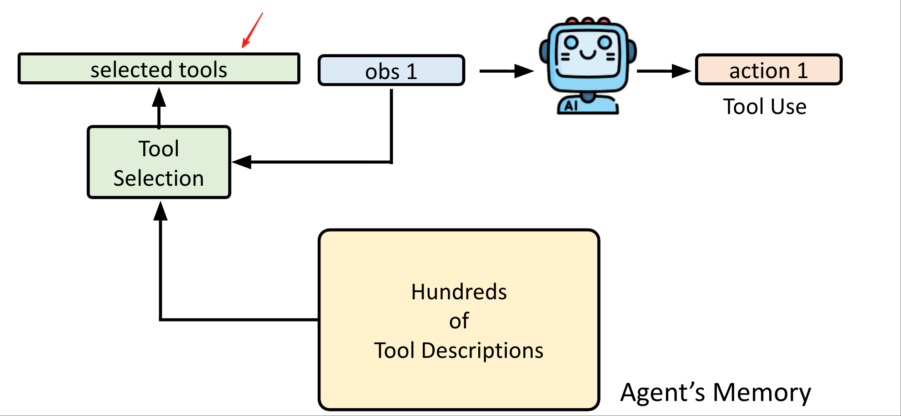
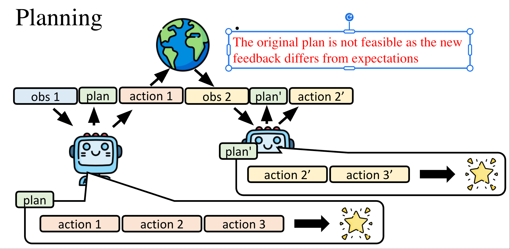

# Agentic AI

## High Level Concepts

AI Agents are designed to autonomously reason, plan, and take action. To operate effectively, building AI Agents should follow some fundamental principles that make AI agents more reliable, intelligent, and practical in real-world applications:

- Role-playing
- Focused tasks
- Custom tools
- Multi-agent collaboration
- Agent constraints
- Agent memory

### What is Agentic AI

 **Agentic AI**: Agentic AI refers to autonomous artificial intelligence systems capable of independently reasoning, planning, and executing multi-step tasks to achieve goals with reduced human oversight. Unlike reactive AI, agentic AI is proactive, learning, and adapting to changing environments by making informed decisions and taking initiative rather than simply responding to direct prompts or triggers. Below is a visualization of Agentic AI System. Bellow, shows how Agentic AI system works from a conceptual level:

  

The Core Capabilities of AI Agents(see 2)

- Adjust behaviors based on experience
- How to use tools
- Planning

### Adjust Agent behavior based on experience

We introduce agent memory to store its past experiences, including its past actions, feedback(observations) from external environment.

To improve the capability of learning from experience, we  introduce read, write, and reflection subordinary modules to the Agent memory module.

- Read Module: After multiple rounds of agent loops, the agent may accumulate long memories, which can make it difficult to determine the next appropriate action. To address this, a memory reading module is used. This module retrieves only the relevant memories needed for the current action. By essence, the memories reading module is a RAG system.

  

- Optimize what to write to memories: only write memories that are useful

- Reflection module: refine and abstract experiences. The experience can be built as knowledge graph
  

To learn more about agent memory, please the papers introduced on [this page](https://docs.google.com/presentation/d/1kTxukwlmx2Sc9H7aGPTiNiPdk4zN_NoH/edit?slide=id.p46#slide=id.p46)

### How AI Agent Uses Tools

A tool is something an agent knows how to use and does not need to  understand how it works under the hood.

- In an agentic AI system, the LLM serves as the brain that performs the reasoning work. The LLM of the AI agent determines which tools to use and with what input.There are two types of prompts given to the LLM:

  - System prompts: define the conditions and context that the agentic system needs to comply with and understand
  - User prompt: instructions and information provided by the user to the agentic system
- The practices of using tools
  - AI agents may have access to many tools. Following the memory module approach, we can store tool information in agent memory and retrieve only the tools relevant to the current action. You can read relevant tool selection module related papers on [this page](https://docs.google.com/presentation/d/1Kzr5Sb0DkuqLFcepS61h6ahHkf_8_jP1/edit?slide=id.p57#slide=id.p57)

  
  - Agent can also create its own tools, see relevant papers on [this page](https://docs.google.com/presentation/d/1kTxukwlmx2Sc9H7aGPTiNiPdk4zN_NoH/edit?slide=id.p57#slide=id.p57)
  - AI Agent may make mistake due to its judgement issue. Hence, we need to remind Agent having its own judgement, don't believe in tools blindly. See more about how LLMs make judgement [here](https://youtu.be/M2Yg1kwPpts?si=eMDxJGXyv36DPxfk&t=3911)

### Can AI Agents Plan?

- Apply Chain of thought prompt to force LLMs plan first.
- Ideally, Agents need to adapt to environmental feedback; one possible approach is to replan based on new feedback from the environment.

- How to improve agent's planning capability
  - implement to iterate the plan -> run the plan in [virtual env(world model)](https://youtu.be/M2Yg1kwPpts?si=H-Fr4v3LvNA5oFEg&t=5816)
  
## Software Implementation

## Engineering Practice

- [The Agent Development Life Cycle](https://sierra.ai/blog/agent-development-life-cycle)

- [Designing AI-Intensive Applications - swyx](https://www.youtube.com/watch?v=IHkyFhU6JEY)
- [12-Factor Agents: Patterns of reliable LLM applications — Dex Horthy, HumanLayer](https://www.youtube.com/watch?v=8kMaTybvDUw)

- [evals]: evaluate your llms or ai system. see 4.1, 4.2 & 4.3
- evaluate the memory module performance
- [Building Agents at Cloud Scale — Antje Barth, AWS](http://youtube.com/watch?v=WJjInLeaJjo&list=PLcfpQ4tk2k0W3ORTR-Cr4Ppw6UrN8kfMh&index=27)
- [Amazon Bedrock](https://aws.amazon.com/bedrock/), a aws service that helps you to connect with llm providers and integrate with aws other services.
- Evals:
  -  **[Five hard earned lessons about Evals — Ankur Goyal, Braintrust](https://www.youtube.com/watch?v=a4BV0gGmXgA&list=PLcfpQ4tk2k0W3ORTR-Cr4Ppw6UrN8kfMh&index=3)
  - **[The Future of Evals - Ankur Goyal, Braintrust](http://youtube.com/watch?v=MC55hdWLq4o&list=PLcfpQ4tk2k0W3ORTR-Cr4Ppw6UrN8kfMh&index=12)
  - [As the day August 2025,  evals is the top painful things for AI Engineer ](https://youtu.be/mQ7_Zje7WKE?si=LsH3XKsNWuzyhjaR&t=689)
- **[How to train your Agent](http://youtube.com/watch?v=gEDl9C8s_-4)

## References

- 1.[Agentic AI Definition by google search](https://www.google.com/search?q=agentic+ai+definition&sca_esv=fe03dc12a99e2005&rlz=1C5CHFA_enUS1104US1104&sxsrf=AE3TifMS3QsbDVUq9VaPjpOFhW3tec8iQA%3A1757348573732&ei=3QK_aM3CLP6t0PEPybCy-Q4&oq=&gs_lp=Egxnd3Mtd2l6LXNlcnAiACoCCAAyBxAjGCcY6gIyBxAjGCcY6gIyBxAjGCcY6gIyBxAjGCcY6gIyBxAjGCcY6gIyChAjGPAFGCcY6gIyBxAjGCcY6gIyBxAjGCcY6gIyBxAjGCcY6gIyBxAjGCcY6gIyExAAGIAEGEMYtAIYigUY6gLYAQEyExAAGIAEGEMYtAIYigUY6gLYAQEyExAAGIAEGEMYtAIYigUY6gLYAQEyExAAGIAEGEMYtAIYigUY6gLYAQEyExAAGIAEGEMYtAIYigUY6gLYAQEyExAAGIAEGEMYtAIYigUY6gLYAQEyExAAGIAEGEMYtAIYigUY6gLYAQEyExAAGIAEGEMYtAIYigUY6gLYAQEyExAAGIAEGEMYtAIYigUY6gLYAQFIy0JQ0AdY0AdwAXgCkAEAmAEAoAEAqgEAuAEByAEA-AEBmAICoAIRqAITwgIEEAAYR5gDDeIDBRIBMSBA8QWi97_JQcHpT4gGAZAGCLoGBggBEAEYAZIHATKgBwCyBwC4BwDCBwcwLjEuMC4xyAcP&sclient=gws-wiz-serp)
- 2.[[生成式AI時代下的機器學習(2025)]第二講：一堂課搞懂 AI Agent 的原理 (AI如何透過經驗調整行為、使用工具和做計劃)](https://www.youtube.com/watch?v=M2Yg1kwPpts)
- 3.[Architecting Agent Memory: Principles, Patterns, and Best Practices — Richmond Alake, MongoDB](https://www.youtube.com/watch?v=zLv2o5hRdXs)

- 4.1 [Iterate, eval, ship. Braintrust is the evals and observability platform for building reliable AI agents](http://braintrust.dev/)
- 4.2 [Evals Are Not Unit Tests — Ido Pesok, Vercel v0](https://www.youtube.com/watch?v=L8OoYeDI_ls&list=PLcfpQ4tk2k0W3ORTR-Cr4Ppw6UrN8kfMh&index=16)
- 4.3 [2025 is the Year of Evals! Just like 2024, and 2023, and … — John Dickerson, CEO Mozilla AI](https://www.youtube.com/watch?v=CQGuvf6gSrM&list=PLcfpQ4tk2k0W3ORTR-Cr4Ppw6UrN8kfMh&index=17)
- **[Make your LLM app a Domain Expert: How to Build an Expert System — Christopher Lovejoy, Anterior](https://www.youtube.com/watch?v=MRM7oA3JsFs)
- ** [Building Production-Ready Agentic Systems: Lessons from Shopify Sidekick](https://shopify.engineering/building-production-ready-agentic-systems)
- [Introduction to Generative AI and Machine Learning 2025 - Lecture 2: Context Engineering — Key Technology Behind AI Agents](https://www.youtube.com/watch?v=lVdajtNpaGI)