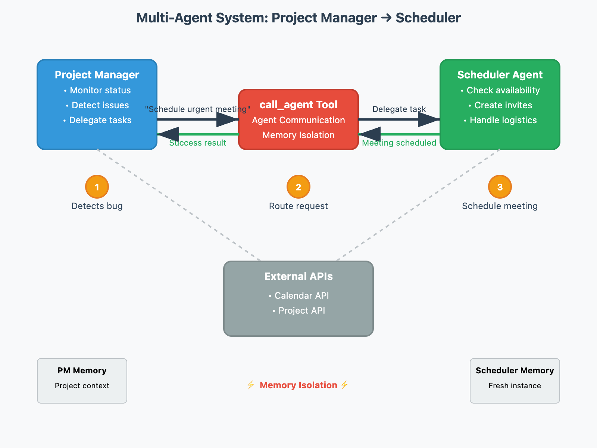

# Multiple Agent Systems

## Progress

- [x] 01. Introduction to Multi-Agent Systems: brain, coordination and share information. Decomposition and conquer => more predictable and easier to maintain
- [x] 02. Building Multi-Agent Systems: Agent-to-Agent Communication
  - [x] [how agent registry and action context works](./codebase.md#how-to-do-agent-discovery)
  - diagram
    
  - [x] benefits of doing so
    - only provides the minimum yet sufficient information to the called agent, to reduce security and stability concerns
    - provide fresh memory for each agent call to avoid LLM sticky to its reached conclusion
- [x] 03. Agent Interaction & Memory
  - system analysis: agent1 -information-> agent2
    - agent1 could have no idea about what agent2 wants
    - agent2 could be a new intern (agent 2 is capable but lacks of context)
    - information could also go wrong even if every one in this process tried their best, for example, the information passed by is a summary of a huge amount of whole context by the agent1 who is not good at information retrieval.
  - solution
    - message
    - shared memory: depends on situation, some agents can also commit a memory item in the shared memory.
- [x] 04. [Agent Interaction Patterns with Memory](./03.agent-interaction-and-memory.md)
  - [x] Solutions:
    - Message passing mode
    - Shared Memory Model
  - [x] decision tree: Choose coordination approaches based on task complexity, required isolation, and context needs.
- [x] Agent interaction patterns with memory.
  - [x] Message Passing: The Basic Pattern
  - [x] Memory Reflection: Learning from the Process. For example, if a research coordinator agent asks a data analysis agent to study some results, seeing the analysis process helps the coordinator better understand and use the conclusions.
  - [x] Memory Handoff: Continuing the Conversation: This is like having a colleague step in to take over a project - for example, the customer support agents hands off the task to a tech support agent with the problem description.
- [x] 05. Removing Noise: Focusing Agent Attention
  - constraints
    - output token is more expensive than input
    - LLM usually can take in more token than its output
  - solutions pros and cons
    - options:
      - extract relevant task info
      - or output memory task
    - pros and cons
      - Hallucination Prevention
      - Environment safety:Agents can only reference existing memory without modifying content, cannot summarize or rewrite original information, and protects data integrity especially for API query results.
      - Specialized Selection - Enables designing dedicated "selector" agents specialized in identifying relevant memory fragments, reducing burden on the main agent.
      - Scalable Processing - The second agent can receive large amounts of context information, exceeding the first agent's output limitations and fully utilizing input token capacity.
- [x] 06. Advanced Agent Interaction
- [x] 07. Providing Agentic AI Information About the World
  > Treat AI like a highly capable but completely uninformed intern who needs comprehensive context about your specific situation, systems, and goals to perform effectively.
- [ ] 08. Agent Interaction Architectures

## Recap of the Four Memory Sharing Patterns

Each of these patterns serves a different purpose in agent collaboration:

Message passing keeps interactions simple and focused
Memory reflection helps agents learn from each other’s processes
Memory handoff enables seamless continuation of complex tasks
Selective memory sharing provides relevant context while reducing noise
The choice of pattern depends on your specific needs:

How much context does the second agent need?
Does the first agent need to understand the second agent’s process?
Should the conversation history be preserved?
Is there sensitive information that should be filtered?
By understanding these patterns, you can design agent interactions that effectively balance information sharing with task focus, leading to more efficient and capable multi-agent systems.
