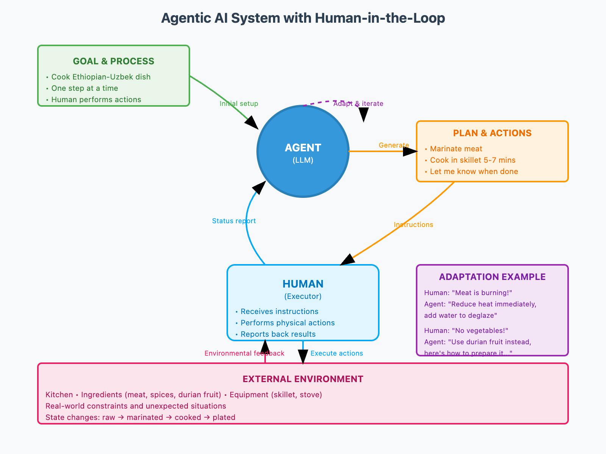

# Module 1: AI Agent Concepts

## Progress

- [x] 01. Introduction
  - agentic system is more adaptable and interpretable to traditional computer system
  - the prompt: clearly dictated the goal and process clearly
    > You're going to help me cook whatever I need. Since you can't directly lift pots or pans or get to the fridge, you will tell me the steps and I will perform them. We will go one step at a time, ask me for what I want to cook.
  - system visualization
  
- [x] 02. Flipped Interaction Pattern
  - The prompt pattern: *Ask me questions one at a time in order to get enough information to [GOAL]. Ask the first question.*
    - **One at a time**: Best practice for agentic systems
    - **Goal-oriented**: Clear objective provided upfront
    - **Start trigger**: "Ask the first question" or "Tell me the first step"
  - [x] Test the prompt with ChatGPT to solve a real problem in life
- [ ] 03. The Agent Loop
- [ ] 04. Running the Code Samples in the Course
- [ ] 05. Programmatic Prompting for Agents
- [ ] 06. Try Out Programmatic Prompting
- [ ] 07. Programmatic Prompting for Agents II
- [ ] 08. Programmatic Prompting for Agents III
- [ ] 09. Try Out the Customer Service Agent
- [ ] 10. Giving Agents Memory
- [ ] 11. Practicing Programmatic Prompting for Agents
- [ ] 12. Practicing Programmatic Prompting for Agents (Solution)
- [ ] 13. Adding Structure to AI Agent Outputs
- [ ] 14. Building Your First Agent
- [ ] 15. AI Agent / Environment Interface
- [ ] 16. AI Agent Feedback and Memory
- [ ] 17. Learning More & Staying Connected
- [ ] 18. Understanding Feedback & Memory (Graded Assignment)
