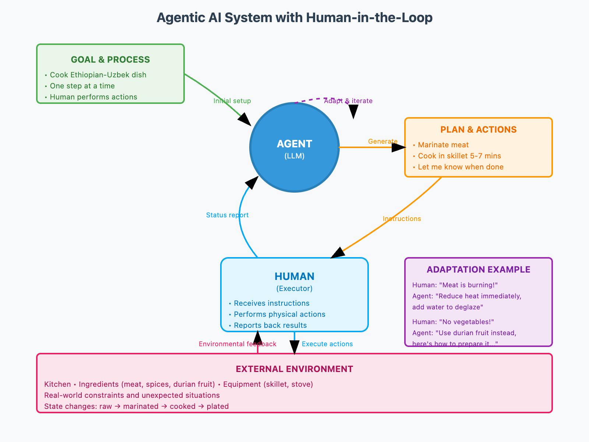
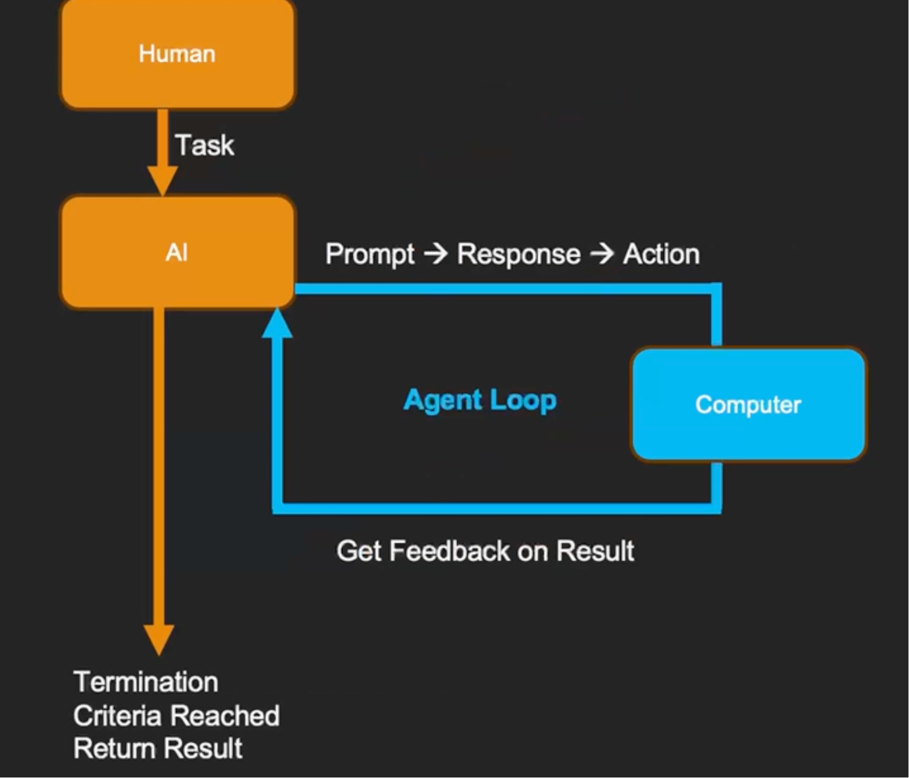

# Module 1: AI Agent Concepts

## coding task

- [x] [Building a Quasi-Agent](https://www.coursera.org/learn/ai-agents-python/ungradedWidget/7uXZ1/practicing-programmatic-prompting-for-agents)
- [x] try out customer support Agent
- [x] Building Your First Agent

> Now that you understand the agent loop and how to craft effective prompts, we can build a simple AI agent. This agent will be able to list files in a directory, read their content, and answer questions about them. We’ll break down the agent loop—how it receives input, decides on actions, executes them, and updates its memory—step by step.

## Progress

- [x] 01. Introduction
  - Agentic system is more adaptable and interpretable to traditional computer system
  - the prompt: clearly dictated the goal and process clearly
    > You're going to help me cook whatever I need. Since you can't directly lift pots or pans or get to the fridge, you will tell me the steps and I will perform them. We will go one step at a time, ask me for what I want to cook.
  - system visualization
  
- [x] 02. Flipped Interaction Pattern
  - The prompt pattern: *Ask me questions one at a time in order to get enough information to [GOAL]. Ask the first question.*
    - **One at a time**: Best practice for Agentic systems
    - **Goal-oriented**: Clear objective provided upfront
    - **Start trigger**: "Ask the first question" or "Tell me the first step"
  - [x] Test the prompt with ChatGPT to solve a real problem in life
- [x] 03. The Agent Loop
  - there are two phases: kick off then agent run till termination condition
  - diagram
  
  
- [x] coding topics
  - [x] topics
    - [x] 04. Running the Code Samples in the Course
    - [x] 05. Programmatic Prompting for Agents
    - [x] 06. Try Out Programmatic Prompting
    - [x] 07. Programmatic Prompting for Agents II
    - [x] 08. Programmatic Prompting for Agents III
  - learnings
    - [litellm](https://github.com/BerriAI/litellm):
      - switch llm without rewriting whole code
      - you may need to adjust prompts based on llm platform
    - Message type: The system message is the most important part of this prompt. It tells the model how to behave. The user message is the question that we want the model to answer. The system instructions lay the ground rules for the interaction.
      - "system": Provides the model with initial instructions, rules, or configuration for how it should behave throughout the session. This message is not part of the "conversation" but sets the ground rules or context (e.g., "You will respond in JSON.").
      - "user": Represents input from the user. This is where you provide your prompts, questions, or instructions.
      - "assistant": Represents responses from the AI model. You can include this role to provide context for a conversation that has already started or to guide the model by showing sample responses. These messages are interpreted as what the "model" said in the past.
  - [x] 09. Try Out the Customer Service Agent
- [x] 10. Giving Agents Memory
  - stateless nature of LLM, no model is trained in API interaction
  - to maintain continuity, provide previous messages in each input
  - memory management: We can control what the LLM remembers or does not remember by managing what messages go into the conversation. Causing the LLM to forget things can be a powerful tool in some circumstances, such as when we need to break a pattern of poor responses from an Agent.
- [x] 11. Practicing Programmatic Prompting for Agents
- [x] 12. Practicing Programmatic Prompting for Agents (Solution)
- [x] 13. Adding Structure to AI Agent Outputs
  - why: traditional software needs structured input
  - In the [following course](https://www.coursera.org/learn/ai-agents-architecture-python), there is a guide to make structured output with required json format. The learning in this tutorial is asking LLM to give its reasoning process
- [x] 14. Building Your First Agent
  - [How Claude escapes from prompts designed to cause infinite thinking loops](./codebase.md#how-llm-for-example-claude-terminates-its-thought-if-you-asked-a-question-makes-it-loop)
  - define agent rules: Before the agent begins its loop, it must have a clear set of rules that define its behavior, capabilities, and constraints. These agent rules are specified in the system message and play a critical role in ensuring the agent interacts predictably and within its defined boundaries.
    - agent focus on what to do we create a system that leverages the LLM for high-level reasoning while relying on well-defined code for execution.
    - This separation of reasoning and execution is what makes the agent loop so powerful
- [x] 15. AI Agent / Environment Interface
- [x] 16. AI Agent Feedback and Memory
- [x] 17. Learning More & Staying Connected
  - [x] Stay Up to Date in a Rapidly Changing AI Landscape, join professor's circle community
  - [x] Read the paper: ["Living Software Systems" and the future that AI Agents will make possible](https://arxiv.org/pdf/2408.01768)
- [x] 18. Understanding Feedback & Memory (Graded Assignment)
