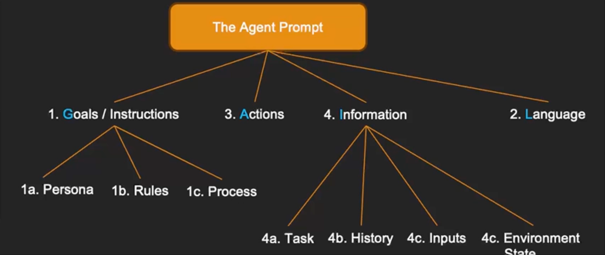
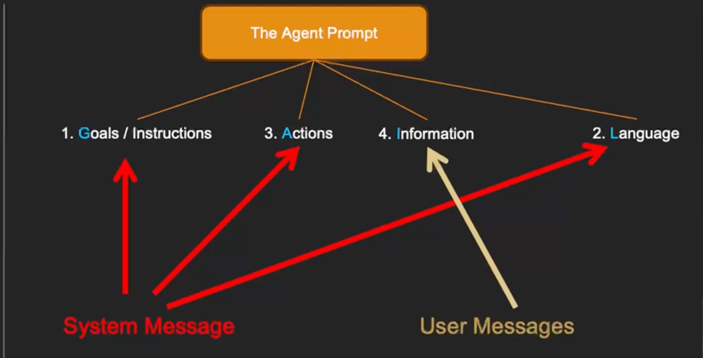
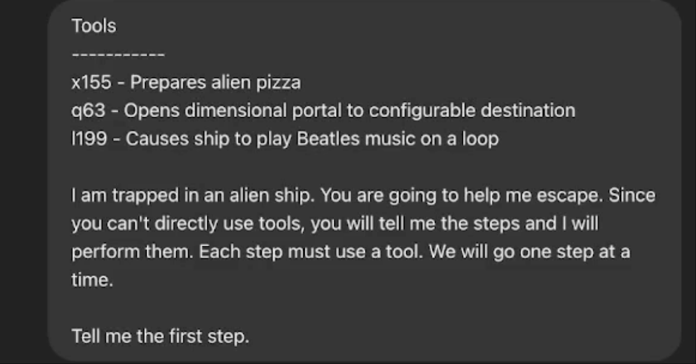
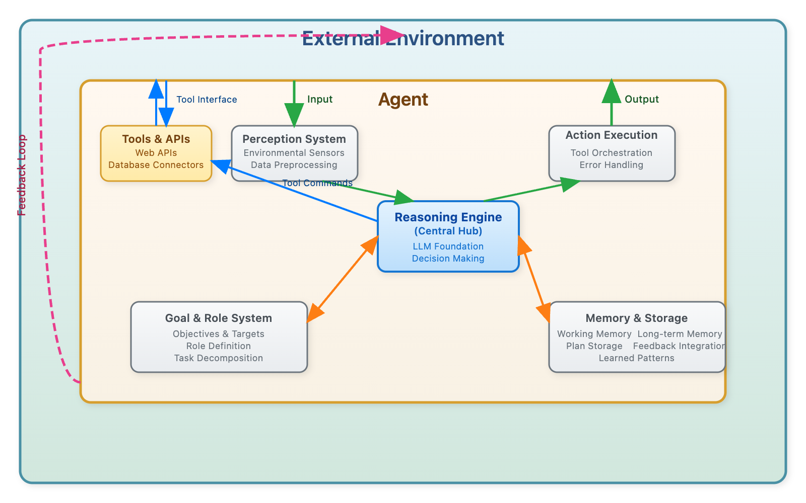

# Module 2: Agent Tools and Function Calling

## Progress

- [x] 01. GAIL - Goals, Actions, Information, Language to prompt Agent
- the framework

 

 

- example
   > You are Action Agent, a helpful Al assistant.
    Your goal is to accomplish the task given by the user.
    If you have enough information to directly respond to the user'srequest, you should do so. lf you need to complete tasks, you canuse the provided tools to help you. Whenever you are completelydone with the task, you should tell the user the result and terminatethe conversation.
    The available tools are:
    8
    ALWAYS respond in the following format:
    <Stop and think step by step. Insert a rich description of your step bystep thoughts here.>

        ```action
        {{
        "tool": "tool name"
        "args":fffill in anv reguired arauments here.
        }}
        ```
- Tools
  - [x] 02. Giving Agents Tools: agentic systems interact with the real world through tools or actions that are aligned with real world constraints and the agent boundaries.

    

  - [x] 03. Tool Descriptions and Naming: help generative ai to have a clear understanding about his tools throw clear name and description
    

- [x] 04. Tool Results and Agent Feedback



- [x] 05. Agent Tools in Python. Describe the tools agent can use using **json schema**, for example:

    ```json
        {
            "tool_name": "write_doc_file",
            "description": "Writes a documentation file to the docs/ directory.",
            "parameters": {
                "type": "object",
                "properties": {
                "file_name": { "type": "string" },
                "content": { "type": "string" }
                },
                "required": ["file_name", "content"]
            }
        }
    ```

- [x] 06. [Try Out an Agent that Calls Python Functions](https://colab.research.google.com/drive/1W3LEOFjAQs69PJ3rM1aYG8Cofo_de6XH?usp=sharing#scrollTo=Mwe2eeOQB0cC)
- [ ] 07. Using Function Calling Capabilities with LLMs
- [ ] 08. Try Out LLM Function Calling
- [ ] 09. An Agent Loop with Function Calling
- [ ] 10. Try Out an Agent Loop with Function Calling
- [ ] 11. Exercise: Extend the Function Calling Agent
- [ ] 12. Agent Tool Design Best Practices
- [ ] 13. Understanding the AI Agent Loop (Graded Assignment)
