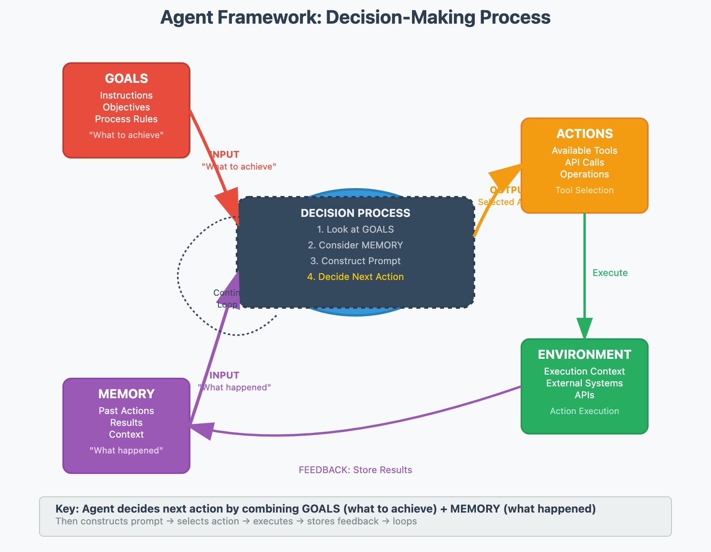

# Module 3: GAME Framework and Agent Design

## Progress

- [x] 01. Overview of the GAME Framework:
  - what is it ?: Goal, Action, Memory, Environment.
  - 
  - implementation tricks:
    - prototype the agent conversations quickly to identify
    - check [agent.py](./topics/code/angent.py) to view codebase concept design  in Python
- [ ] 02. Designing AI Agents with GAME
- [ ] 03. Simulating Agents in ChatGPT
- [ ] 04. Simulating GAME Agents in Conversation
- [ ] 05. Modular AI Agent Design
- [ ] 06. Agent Loop Customization
- [ ] 07. Implementing GAME in Code
- [ ] 08. Try Out the Agent Framework
- [ ] 09. How Your Agent Communicates with the LLM: The Agent Language
- [ ] 10. Putting It All Together: Document Your Code with a README Agent
