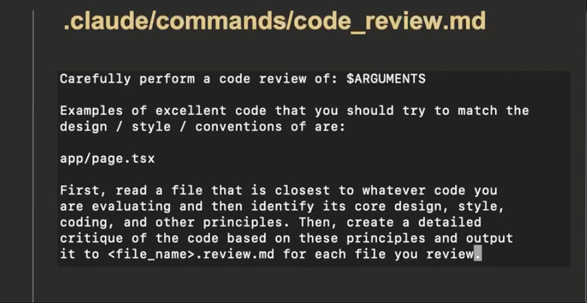

# Claude Code: Software Engineering with Generative AI Agents

- About the course: This course is part of Generative AI Software Engineering Specialization on `Coursera`. To learn more, please visit its [course page](https://www.coursera.org/learn/claude-code?specialization=generative-ai-software-engineering).

- What you'll learn from the course

  - Master AI-Powered Software Development at Scale - Learn to orchestrate Claude Code like a tech lead managing multiple senior developers

  - Build Production Systems with AI Labor Economics - Understand how to leverage Claude Code's speed and cost advantages to prototype rapidly

  - Architect for AI-First Development - Design codebases, workflows, and processes that maximize AI productivity
- Other Practices
  - [Anthropic: Enabling Claude Code to work more autonomously](https://www.anthropic.com/news/enabling-claude-code-to-work-more-autonomously) 

## Major Ideas

See the same pattern:

> 1.define goal -> strategies -> iterate and battle test strategy -> implementation
> 2. Treat AI as a human labor

### Module 1: Scaling up Software Engineering with  Claude code and generative AI

- 1000X Improvement in Software Engineering Productivity with Big Prompts
  - Micro managing mentality: (5~10x)
    - Do not micromanage 1000 developers, inspire and challenge them.
    - example:
  - think big: (1000x productivity improvement), looking things from sky
    - Instead, command it building software from the real user's perspective
     example: Act like a typical user of this application, then create different ways of sorting , filtering, and displaying the expenses that are incredibly powerful and useful
  - why think big instead of micro managing: You are the bottle neck in the code domain, given the current AI capability. You should act as an innovator, entrepreneur, and take fully advantage of the AI labor

### Module 2 Leverage the Engineering capability of Claude

- One Software Engineer to Another: Let's Talk About the Fear
    > Coming from the background of being a professional software engineer, the lecturer had a fear moment. After adapting himself to Claude code, he felt far more fun in coding, switching from a coder and thinker to a pure visionary and thinker ( in software domain) in making a product.
- AI is Labor, Claude code is an AI development team.
  - The Mindset shift are
    - you need to prompt in a way that allows the AI labor work
    - Do you want ONE faster AI coworker or hundreds of developers that you direct?
  - Think bigger, leader -> team -> individual
  - How:
    - you need to prompt in a way that allows the AI labor to scale
    - do you want one faster AI coworker or hundreds of developers that you direct?
  - leader gives direction and vision, expectation(result guideline), micromanager gives task and task instructions
- The Best of N Pattern: Leverage AI Labor Cost Advantages
  - The Best-of-N pattern leverages a unique advantage of AI labor: it's fast, cheap, egoless, and creative. Extract max values from AI labors
  - > Software Engineering as Search, command AI labors to search the best version for us.

### Module 3: Generative AI, Claude Code, & Code Quality

- Can AI judge Code Quality?
  - High-quality code requires the ability to recognize it
  - Short Answer:
    - Yes.
    - Use AI to judge AI: define a rubric and evaluate against it; models have learned broad code patterns
  - Code quality is context-dependent (e.g., error handling needs vary)
  - Does AI understand design principles? Yes—Claude Code generally follows software design principles, for example, SOLID principle.
- process: T
  - traditional process:  talk with users/customers -> define & scope problem -> scope out requirements [prod -> software]-> code
  - [chat -> craft, persona pattern] -> build. Chat, Craft, Scale: Spend More Time on Designing & Innovating.
  - Chat:
    - Craft and Explore Requirements & Options ->
    - Rapid Prototyping & Personas.
      > **Act as the first API.** I will type in pseudo-http requests and you will respond an http response like the server would. Show me some response HTTP requests I can send you
  - craft: iterating implementation details on paper
    - > Design three different fluent clients in javascript for interacting with  the API. Only show me the interface usage through examples.
    - > I like the first version of the all the design patterns, now, write a complete prompt that I can  cut/paste into Claude Code to get it implement this.
    - > this is a lot to do all at once. Let's speak this plan into a series of incremental steps. We want each step to end in a testable state and a commit. You choose how many increments.
    - segment big prompt into incremental steps/plans

More time is spent on designing the guide

### Module 4: Building Process & Context in Claude Code

- Though Claude Code is powerful, it is still a LLM system and has some of the innate limitations of the time.

  - High level guidelines go to `claude.md`
  - targeted context and process for specific, repeated tasks go to `.claude/commands/<task_name>.md`

- Global Persistent Context:  `CLAUDE.md`
  - context + instructions -> (go into) Claude Code
  - more context
- Reusable Targeted Context & Process: Claude Code Commands
  - practice: give it the targeted context and process
  - how: Claude code command
  - examples
    - code review
      - > create: .claude/commands/some_command.md, see example below:
        
      - then you can activate a command on terminal
      - you can see [the full code review command design in this file](./code_review.md)

### Module 5: Version Control & Parallel Development using Claude

- Claude Code, Version Control, & Git Branches: Claude does amazing git commit message, you can setup guideline in the `Claude.md`
- Allowing Claude code to Work in Parallel with Git Worktrees, see
  - [Allowing-Claude-Code-to-Work-in-Parrallel-with-Git-WorkTrees](./materials/Allowing-Claude-Code-to-Work-in-Parrallel-with-Git-WorkTrees.md)
  - and [Claude Subagents and Tasks](./materials/claude-subagents-tasks.md)

### Module6 Improve Claude Code Scalability and Reasoning

- provide feedback to Claude code at the situations it can't collect feedbacks automatically
- Ensure Claude Code check its own work, enforce process / practices of yours:
  1. Before you make any change, create and checkout a feature branch "namedfeature_some_short_name". Make and then commit your changes in this branch.
  2. You must write automated tests for all code
  3. You must compile the code and pass ALL tests before committing.3.
- Project Structure and File Naming is Critical Context for Claude Code Scalability
- Start By Fixing the Process & Context, Not the Code.

 > Optimize the Claude.md and Commands to improve the overall process and scalability, not the Claude output artifacts(code)

## Other Learnings & Interesting findings

- API design Patterns
  - Resource Oriented Design ( Classic REST)
  - Action Oriented Design (GPRC)
  - Detail Examples
- LLM can act as any conceptual thing.
- Claude Code has strong capability in doing planning
