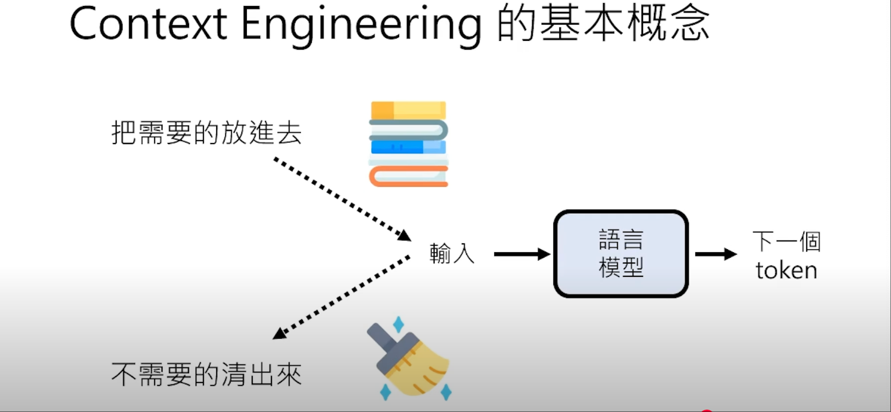

# Introduction to Context Engineering

- **Course lecture**: [Agent.pdf](https://speech.ee.ntu.edu.tw/~hylee/GenAI-ML/2025-fall-course-data/Agent.pdf)
- **About**: Context engineering introduced by Professor [Hung-yi Lee](https://speech.ee.ntu.edu.tw/~hylee/index.php) in his [Generative AI Introduction Course of 2025](https://speech.ee.ntu.edu.tw/~hylee/GenAI-ML/2025-fall.php)

## Introduction

1. **Provide clearer and better conditions**: If you want an LLM to work better, you need to provide clearer and better conditions in the prompt
2. **Provide better premises**: The better the premise, the better the LLM will work. Narrow down search boundaries
3. **In-context learning**: Provide examples to help the LLM learn patterns and concepts from the in-context examples
4. **What's in the context:**
   1. User prompt (including examples)
   2. System prompt (persona, behaviors, etc.)
   3. Dialog history
   4. Memory
   5. Relevant information from sources
   6. Tool use
   7. Reasoning

So what is the core problem of context engineering? **Avoiding context explosion due to long content.**

## Context Engineering

- [The development of generative AI](https://youtu.be/lVdajtNpaGI?si=ywg5j8eZ_5OZWs7j&t=3813)
   1. Conversational
   2. Agentic workflow: [SOP](https://en.wikipedia.org/wiki/Standard_operating_procedure)
   > SOP: A standard operating procedure (SOP) is a set of step-by-step instructions compiled by an organization to help workers carry out routine operations.[1] SOPs aim to achieve efficiency, quality output, and uniformity of performance, while reducing miscommunication and failure to comply with industry regulations.[citation needed]
   3. Agent
- **Context problems:**
  - LLMs can intake 1M tokens but that doesn't mean they can comprehend 1M tokens
  - [Lost in the Middle](https://youtu.be/lVdajtNpaGI?si=bDqSW3L52zt_5hIv&t=4724): LLMs exhibit a "lost in the middle" phenomenon where they perform significantly better on information located at the beginning and end of long contexts, while struggling to accurately process and recall information from the middle portions
  - [Long content reduces LLM performance](https://youtu.be/lVdajtNpaGI?si=sVFX9AmmhzR5Ykys&t=4693)
  - [Lost in the conversation](https://youtu.be/lVdajtNpaGI?si=EOYPNJkEov_dpZGH&t=4801)
  - Context rot: [How increasing input tokens impact LLM performance](https://youtu.be/lVdajtNpaGI?si=TQ1739w-8yMMAeSY&t=4908)

- **The Solution**: It is essentially memory management
  - **Guidelines:**
    - Remove unnecessary information
    - Add needed information
    
  - **Methods**: Select, compress & multiple agents
    - [Select: RAG](https://youtu.be/lVdajtNpaGI?si=Z_CTQzAGuPf56TVT&t=5080). For example: search to find relevant content → reranking
    - Compress, see [how here](https://youtu.be/lVdajtNpaGI?si=rPBr3npl8J7vV6yj&t=5870)
    - Multi-agent: The supervisor agent coordinates work, each sub-agent does its own domain work and maintains its own context. This leads to a smaller context for each agent.
      - The   [Benchmarking Multi-Agent Architectures](https://blog.langchain.com/benchmarking-multi-agent-architectures/) also discussed the multi-agent two different architecture options.

## References

- [Introduction to Generative AI and Machine Learning 2025 - Lecture 2: Context Engineering — Key Technology Behind AI Agents](http://youtube.com/watch?v=lVdajtNpaGI)
- [Benchmarking Multi-Agent Architectures](https://blog.langchain.com/benchmarking-multi-agent-architectures/)
