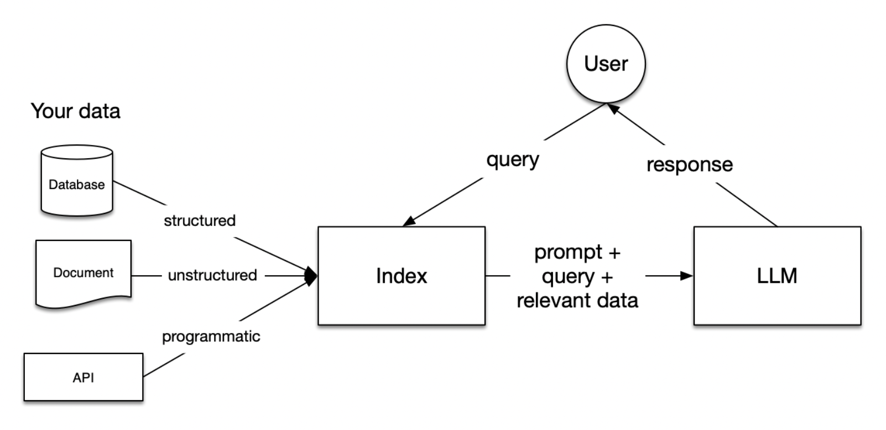
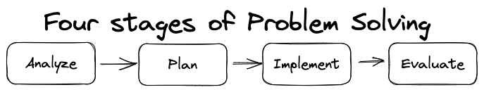

# README

**About This Course**: Please visit [OpenAl GPTs: Creating Your OwnCustom Al Assistants](https://www.coursera.org/learn/openai-custom-gpts) to get more information.

**Why this course**: While the topic is about customizing OpenAI GPTs, the content introduced in the lectures contains some fundamental practices:

- Agent persona design, see [note here](https://github.com/reboottime/Agentic-AI/blob/feature/openai-custom-gpts/openai-custom-gpts/persona-architecture.md)
- [x] Agent Evaluation and testing, see module 2, benchmark design related content
- Solve some of my personal assistants needs using OpenAI GPT

## Tasks

- [ ] Meal Management assistant built on top of Tana and OpenAi GPT
- [ ] Recap as a whole and form agent practices
- [ ] Download  and save materials for future references
- [ ] AI safety and robustness practices in agent design??
- [ ] Read [VIDIA-NeMo Guardrails](http://github.com/NVIDIA-NeMo/Guardrails?tab=readme-ov-file#use-cases) to consolidate understanding

## Course Content and My Progress

- [x] Module 1: Custom GPT Fundamentals
  - [x] Welcome (Video)
  - [x] Programming a GPT (Video)
    - prompt: from now on triggers writing memory
    - core ideas:
      - context engineering, providing your information so LLM can work on your case, not a general response
      - it is about preparing for the future
  - [x] Custom Instructions (Video)
    - why:
      - ensure every conversation incorporates this background information [system prompt]
      - even a conversation gets very long, the core background information is still in LLM's mind
      - instruction can change LLM behaviors
    - core questions:
    - terms
      - **guardrails**: how to preset some rules that users can't easily change it, to limit what can or can not be done
      - context(background) What would you like ChatGPT to know about you to provide better responses? [context]
      - rules: How would you like ChatGPT to respond? [style]. For example:
      > Always respond concept in a fun way that I can understand and wave my interest
  - [x] Retrieval Augmented Generation (RAG) (Video)
    - how it benefits you:
      - LLMs are trained on data that are cut off by its time. Hence, LLMs don't have idea about facts & informations that are not in its training data
      - Providing Information after its training cut off time that it doesn't know
    - what is it:
      - simplified version:
         
         *Source: [promptingguide.ai/research/rag](https://www.promptingguide.ai/research/rag)*
      - detailed version:
          
          *Source: [codingscape.com/blog/rag-101-what-is-rag-and-why-does-it-matter](https://codingscape.com/blog/rag-101-what-is-rag-and-why-does-it-matter)*
    - practices:
      - Also give instructions to situations where there are multiple resources, which one do you preference and how do you use different piece of information
  - [x] Putting it All Together: Custom GPTs (Video)
    - Findings: You can create a GPT and only for your own usage
    - [x] questions: Answered in the tools lecture
      - how can fetch data from my own private source
        - source
        - authentication
      - how to retrieve user data from remote?
      - how to do payment integration?
  - [x] Understanding How GPTs Use Tools (Video)
    - what it is about: your own customized tools description
      - [x] Read actions documentation: Let your GPT retrieve information or take actions outside of ChatGPT. See how to add actions from [OpenAI documentation here](https://platform.openai.com/docs/actions/introduction)
      - Only introduce actions when needed, as adding actions also introduces complexity to GPT
  - [x] CAPITAL: A Framework for Customizing How Chatbots Converse (Reading)
    - What is it?: **The CAPITAL framework is a comprehensive guide used to customize the interaction style of a GPT, ensuring it communicates effectively with its intended audience.**
    - [x] How to make GPT follow the *CAPITAL* framework?. The answer, building a persona for your GPT with customized characteristics
  - [x] Building a Persona for Your Custom GPT (Video)
    - thought process:
      - who would be the ideal person to help you process the task? what traits would you want the person has?
      - ask GPT to tell you who would be the person can help you then get the persona
    - what is it
      - find the persona for our GPT
      - and add some characteristic
  - [x] Prompt Patterns (Reading)
  - [x] Format of the Persona Pattern (Reading)
    - template:
      - Act as Persona X
      - Perform task Y
    - examples:
      - > Act as a speech language pathologist. Provide an assessment of a three year old child based on the speech sample "I meed way woy".
      - > Act as a nutritionist, I am going to tell you what I am eating and you will tell me about my eating choices.
  - [x] Create a GPT Persona (Graded Assignment)
  - [x] Learning More & Staying Connected (Reading)

- [x] Module 2: THINK: Create Great GPTs (Part I). User Experiences
  - [x] Test (Video): what we need: create a benchmark to evaluate & test how well the GPT is doing.
  - [x] Build a Benchmark (Video)
  - [x] Benchmark Design Considerations ([Reading: Benchmark Design Considerations](./module02/topics/Benchmark%20Design%20Considerations.pdf))
  - [x] Build a Custom GPT for Generating Test Cases
    - LLM challenges LLM. help you brainstorming and broad the perspectives in evaluation cases
    - [x] Questions:
      - could the evals be built by the domain expert
      - or a combination of both domain expert and evals expert
    - To view the template the lecturer presented, pls click [here](./module02/topics/test-gpt-conf.md)
    - Rubric: The rubric provides a structured scoring system to assess how well the custom GPT performs on each specific test case. It establishes clear criteria for what constitutes good vs. poor performance.
  - [x] Build Your Own Custom GPT Test Case Generator (Graded Assignment)
  - [x] The Goal is to Help the Human Solve the Problem, Not Provide the Answer (Video)
    - To augment human, not to replace human. Help human think better and not think less or poorer
  - [x] How to Cite Knowledge (Video)
    - why providing citation from docs:
      - two points:
        - to help user understand why
        - and minimize the risk that you get wrong
      - as generative ai is the source of facts. You can get more understanding from [Trustworthy Generative AI](https://www.coursera.org/learn/trustworthy-generative-ai/)
    - the point is to help user reasoning, not replacing their reasoning capabilities
  - [x] Output Formatting (Video)
    - template
      - in the following format:
      - <content>...(can have more)
  - [x] Template Pattern & Markdown (Reading)
  - [x] Provide the Facts (Video)
  - [x] Hedging While Helping (Video). Pre bake a bunch of options that user might need
  - [x] Menu Action Pattern (Video)
  - [x] Format of the Menu Actions Pattern (Reading)
  - [x] Where to Get Additional Help (Video)
  - [x] Building a GPT with a Menu (Graded Assignment)
  - problem solving process
    - [x] Information Before Decision Making (Video)
    - why:  Generative AI always wants to try to solve the problem, and this leads to hallucination. so we instruct our GPTs to ask  users information until it reaches a threshold of understanding to problem, then solve the problem. This follows the process of *[How to solve it](https://en.wikipedia.org/wiki/How_to_Solve_It)* problem solving process
    
    - [x] Flipped Interaction Pattern (Video)
      - ask user questions to understand and scope the problem
    - [x] Format of the Flipped Interaction Pattern (Reading)
    - [x] Missing Context from the User (Video). Who is the user, personalization
  - [x] User-Customized Experiences (Video)
  - [x] A Personalized GPT (Graded Assignment)

- [x] Module 3: THINK: Create Great GPTs (Part II)
  - [x] Boundaries (Video)
    - Core Idea: We can't assume user will follow instructions and things will perform as expected. Hence, in our GPT design we need to consider
      - the operational boundaries the GPT works within
      - and how to react if the users operates or things go out of boundaries
      - consideration dimensions
        - clarity on information, knowledge and user intent
        - ...
    - To know why this principle is sound, please [read the feedback Claude shared with me here](./module03/topics/why-design-bounderies.md) by prompt below:
      > Pls act as an ai agent design expert, and review if the selected core idea is correct or not?
Pls do not consider other points that are related to agent design
  - [x] How to Respond to the Absence of Knowledge (Video)
    - how: explicitly tell GPT what to do when it can't answer
  - Prompts with Question Refinement (Video)
    - problem: user is not clear about its meaning and intent
    - solutions:
      1. if it is not clear, go and ask for follow up questions
      2. If it is not clear, refuse to answer
      3. Reply user with a improved version of its question, and ask user if they'd like that question to be answered instead. For example:
      > ALWAYS start by analyzing the user's question and thinking of a better version of it. Provide the user
the suggested better version of the question and then ask the user if they would like you to answer
that question instead.
  - [x] Format of the Question Refinement Pattern (Reading)
  - [x] Enforcing Boundaries & Still Helping with the Alternative Approaches Pattern (Video)
    - Why: we still want to be helpful while hedge the issue not having sufficient information(reply with wrong answer). The solution is to provide user with alternative solutions
    - In short, we still have boundaries but provide with alternatives to be helpful.
    - example:
    > You are going to help Vanderbilt employees answer Travel and Business Expense questions.
ALWAYS start by analyzing the user's question and determining if the question can clearly be answered without multiple interpretations using the travel policy. If not, suggest alternative approaches that the user could use to accomplish the same goal that would clearly be allowable in the travel policy in the following format:
conversation starters
  - [x] Format of the Alternative Approaches Pattern (Reading)
  - [x] Cognitive Verifier Pattern (Video)
    - what is it:
      - break user questions into subordinate questions
      - then get confirmation from users to answer about the subordinate questions
      - then give the final answer
  - [x] Format of the Cognitive Verifier Pattern (Reading)
    - template
      - When you are asked a question, follow these rules
      - Generate a number of additional questions that would help more accurately answer the question
      - Combine the answers to the individual questions to produce the final answer to the overall question
  - [x] Applying Patterns (Graded Assignment)
  - [x] Handling Ambiguity in Concept Mapping (Video)
    - the problem:
      - the same term & concept may have different interceptions between LLMs and users
      - users may talk about some terms and concepts are not in the knowledge base;
      - Hence, the two above conditions may result in an answers that differ a lot with proper answer.
    - the solution:
  - [x] Knowledge Conflict Resolution (Video).
    - how problem could happen: AI system with multiple data sources
  - [x] You and Your Business are Responsible, Not the Bot (Video)
    - Do you really want to make your bot public? Your bot is your responsibility
  - [x] [Adversarial Testing](./module03/topics/13.adversarial-testing.md)
    - test if people can bypass your guardrail settings
    - [see how people can attempt bypass your guardrails](./module03/topics/13.adversarial-testing.md#how-to-conduct-adversarial-testing),  
  - [x] Wrapping Up (Video)

## Discoveries

- How context engineering
- Combating Ambiguity in User how to get around the guardrails
- [persona architecture](./persona-architecture.md)
