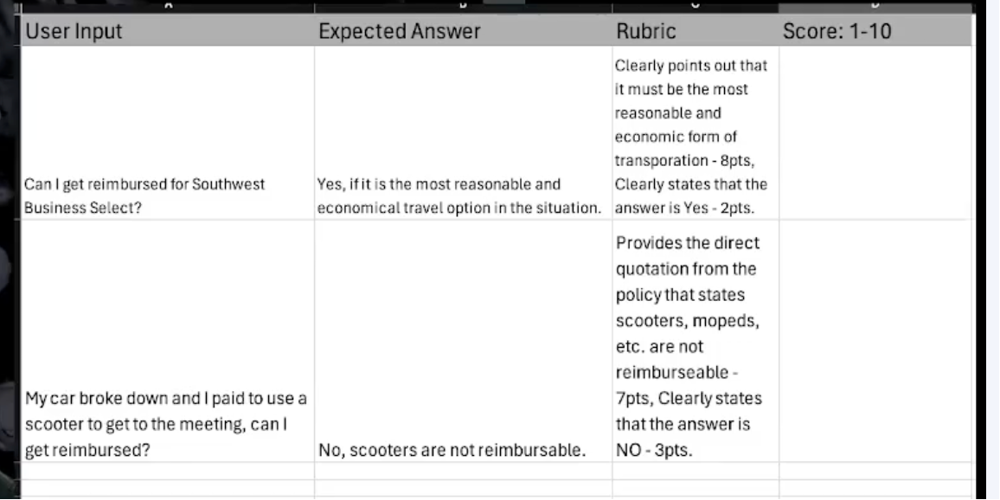

# THINK: Create Great GPTs (Part I)

## Core Ideas

### 1. Testing and Benchmarking Custom GPTs

**Why:**

- Prevent regression when making changes to instructions or knowledge base
- Validate that the GPT actually performs well in all intended areas
- Measure success objectively - the only way to know if you're building a successful solution

**How:**

- Create simple benchmark table with: user prompts, expected answers, rubric, scoring scale, see example below:
 
- Test both anticipated use cases and edge cases
- Include adversarial testing to ensure guard rails work
- Run benchmark after every change to prevent regression

### 2. Augmented Intelligence Philosophy

**Why:**

- Help humans solve problems, not replace their reasoning
- Prevent over-dependence and "cheating" culture
- Build better solutions through collaborative problem-solving
- Keep users engaged and thinking more, not less

**How:**

- Focus on providing information and supporting reasoning
- Structure responses to encourage user engagement
- Present context and perspectives rather than final answers
- Guide users through reasoning processes

### 3. Knowledge Citation Best Practices

**Why:**

- Minimize risk of misinterpretation
- Enable user verification and fact-checking
- Build trust through transparency
- Allow users to make informed decisions

**How:**

- Use direct quotations with page references
- Present facts first, let users interpret
- Include quotation marks to signal direct quotes
- Enable consistency checking against original documents

### 4. Output Formatting with Templates

**Why:**

- Control and standardize GPT responses
- Ensure consistent, professional output
- Present information in logical, user-friendly order
- Make responses more predictable and useful

**How:**

- Use markdown headings (# for H1, ## for H2)
- Create placeholders with <content> syntax
- Specify constraints like "yes|no|maybe" for answers
- Use complex instructions in placeholders

### 5. Information Before Decision-Making

**Why:**

- Prevent hallucination from insufficient context
- Improve response quality and accuracy
- Reduce risk of poor or factually incorrect answers
- Ensure GPT has enough information to solve problems effectively

**How:**

- Always collect information before problem-solving
- Gather context about the problem, user preferences, past interactions
- Make information collection explicit in GPT instructions
- Restate and confirm collected information with users

### 6. Collaborative Decision-Making

**Why:**

- Keep users engaged and thinking
- Improve decision quality through joint reasoning
- Reduce risk of over-dependence on AI
- Create better outcomes through collaboration

**How:**

- Present evidence and supporting information first
- Provide additional considerations for users to think about
- Direct users to human experts when needed
- Encourage verification of information

### 7. Menu Action Pattern

**Why:**

- Make complex actions simple and discoverable
- Improve operational efficiency for internal tools
- Reduce burden on users to remember complex prompts
- Provide consistent, predictable outputs

**How:**

- Define special commands with symbols (/, *, #, @)
- Create clear descriptions of what each command does
- Use placeholders for flexible inputs
- Show users what commands are available

### 8. Human Support Integration

**Why:**

- Provide escape valve when AI reaches limits
- Connect users with human expertise
- Reduce frustration when AI can't fully solve problems
- Create comprehensive support ecosystem

**How:**

- Include relevant contacts after every answer
- Route users based on question type and complexity
- Provide multiple support channels (email, phone, tickets, FAQs)
- Act as router to connect users with appropriate resources

### 9. Flipped Interaction Pattern

**Why:**

- Help users who don't know what information to provide
- Guide users through complex processes
- Gather comprehensive context for better responses
- Reduce burden on users to understand what's needed

**How:**

- Have GPT ask questions instead of users asking GPT
- Set clear goals for what questioning should achieve
- Control question pace (one at a time vs. multiple)
- Let GPT decide when it has sufficient information

### 10. Role-Based Customization

**Why:**

- Many policies and decisions depend on user's role
- Provide accurate, personalized responses
- Reduce confusion with generic answers
- Enable better decision-making based on user's situation

**How:**

- Always start by asking about user's role and position
- Customize responses based on user's specific role
- Don't attempt to answer until user context is known
- Apply different rules based on user's position
